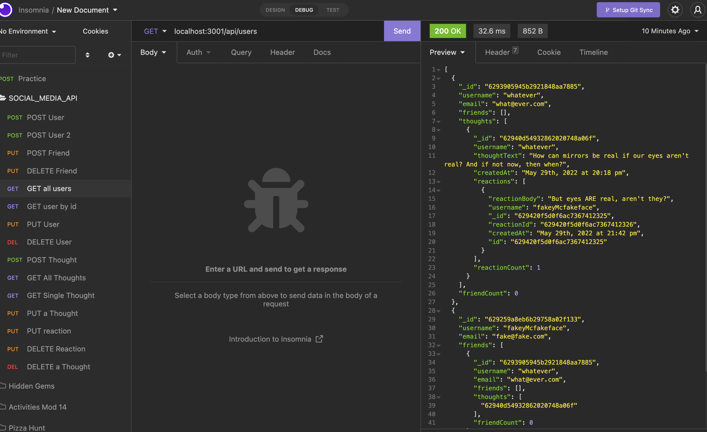
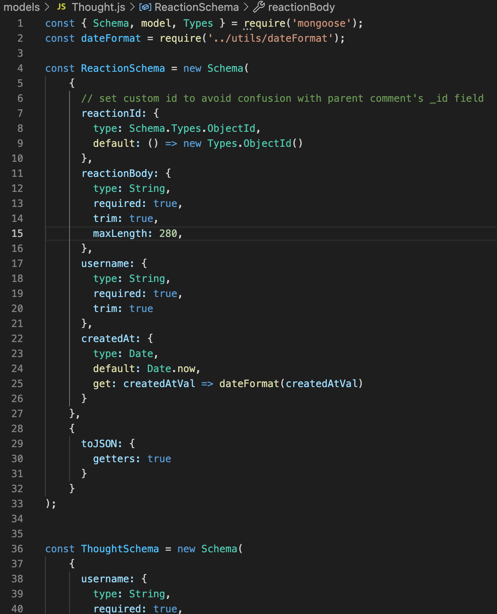
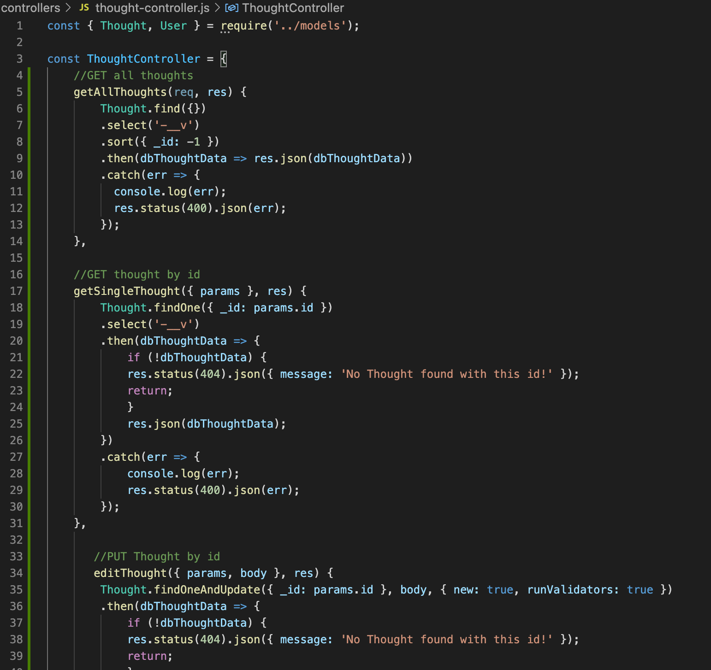
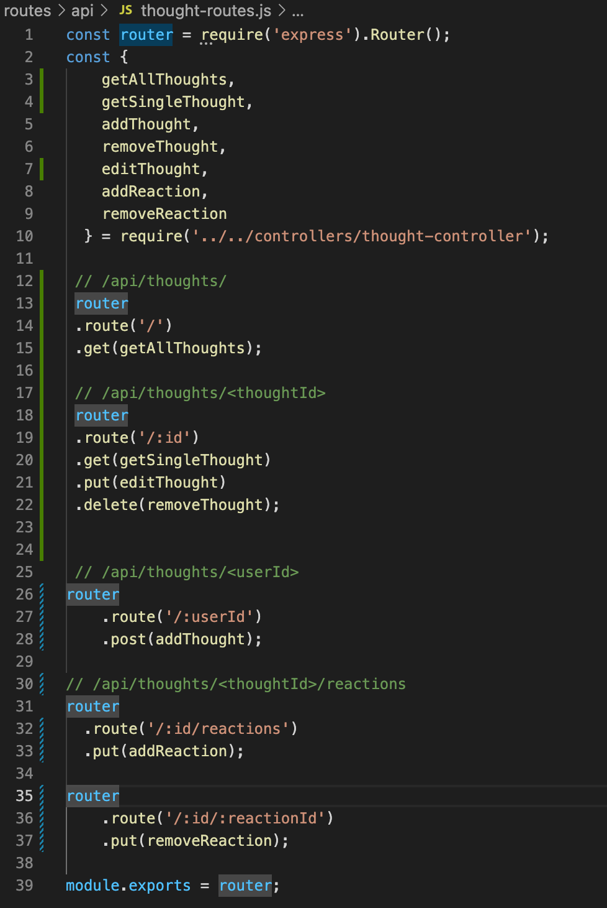

# social-media-api

        

## Table of Contents
- [Description](#description)
- [Installation](#installation)
- [Usage](#usage)
- [Credits](#credits)
- [Contributing](#contributing)
- [Tests](#tests)
- [Questions](#questions)
- [License](#license)  
        

## Description

AS A social media startup

I WANT an API for my social network that uses a NoSQL database

SO THAT my website can handle large amounts of unstructured data

Social-Media-Api is an application that allows for creating users, adding friends, posting and editing thoughts, and adding and deleting reactions to those thoughts. More than that, this challenge is meant to familiarize myself with NoSql through the use of MongoDB and Mongoose. Throughout I will have to learn how to consult the documentation.  

Once complete, the program should operate so that:

GIVEN a social network API

WHEN I enter the command to invoke the application

THEN my server is started and the Mongoose models are synced to the MongoDB database

WHEN I open API GET routes in Insomnia for users and thoughts

THEN the data for each of these routes is displayed in a formatted JSON

WHEN I test API POST, PUT, and DELETE routes in Insomnia

THEN I am able to successfully create, update, and delete users and thoughts in my database

WHEN I test API POST and DELETE routes in Insomnia

THEN I am able to successfully create and delete reactions to thoughts and add and remove friends to a user’s friend list

My first major complication I ran into for this challenge was adding friends. The grading criteria stated that adding friends should be done through a POST route, but when I tried to do that, Insomnia kept asking for the corresponding email and username. I knew, however, that I could get and add the friend's id fairly easily using a PUT method. Looking again at the criteria, I saw that the friend's ID was all I needed for the friends array, so I decided to go ahead and change it to a PUT method, since a working program that gets the same result is better than a non-working one that follows every guideline. I ended up having to do the same thing for deleting a friend, but I also had to create a different route so it wouldn't intefere with the other PUT route. 

## Installation

Links to the repository and the deployed page can be found at [Questions](#questions).

While this project's repository is available on Github, there is no front end, and thus it is not deployed. If you clone the repo you must run the command "npm install" on the Terminal/Command Line and download the dependencies, all of which are mentioned in [Credits](#credits). 

## Usage

Once the project is cloned and the dependencies downloaded, type "npm start" to run the program. 

A screenshot of the GET User route on Insomnia is below.

Screenshots of the thought model, thought controller, and thought route files are below, displaying the steps submitting a thought takes: 

## Credits

The coding boot camp Professional README Guide found at https://coding-boot-camp.github.io/full-stack/github/professional-readme-guide was used as a template for this README. The license was picked from [https://choosealicense.com/](https://choosealicense.com/).The WHEN/THEN section of this README was based off the project assignment Acceptance Criteria. Most influence was taken from Pizza Hunt of Module 18. Stack Overflow, MDN Web Docs, W3, and Google were critical to our success. Insomnia, MongoDB, and Mongoose were used. 

## Contributing

If you make changes, test it locally on a branch before pushing to main. Clone from the github site and make sure to create your own .env file with your own credentials.

## Tests

No Jest tests written were made for this project, but Insomnia is a critical tool in letting you test the program's GET, POST, PUT, and DELETE methods. If you want to run tests, download Insomnia or some similar program, activate the program in Terminal using "npm start", and then use the Localhost URL to try the different methods.

## Questions

The github repository to this project is below:

[https://github.com/willjduncan/social-media-api.git](https://github.com/willjduncan/social-media-api.git)

The site to a video demonstration is below:

[https://drive.google.com/file/d/1S5TEGMSM7Zakefmfl8BiiUQhTZBNFVWC/view](https://drive.google.com/file/d/1S5TEGMSM7Zakefmfl8BiiUQhTZBNFVWC/view)

For any additional questions, I can be reached at the following

Will Duncan: willdunc12@gmail.com
Github: [https://github.com/willjduncan](https://github.com/willjduncan)

## License

[view license link here](https://choosealicense.com/licenses/mit/)

        
MIT License

Copyright (c) [2022] [willjduncan]

Permission is hereby granted, free of charge, to any person obtaining a copy
of this software and associated documentation files (the "Software"), to deal
in the Software without restriction, including without limitation the rights
to use, copy, modify, merge, publish, distribute, sublicense, and/or sell
copies of the Software, and to permit persons to whom the Software is
furnished to do so, subject to the following conditions:

The above copyright notice and this permission notice shall be included in all
copies or substantial portions of the Software.

THE SOFTWARE IS PROVIDED "AS IS", WITHOUT WARRANTY OF ANY KIND, EXPRESS OR
IMPLIED, INCLUDING BUT NOT LIMITED TO THE WARRANTIES OF MERCHANTABILITY,
FITNESS FOR A PARTICULAR PURPOSE AND NONINFRINGEMENT. IN NO EVENT SHALL THE
AUTHORS OR COPYRIGHT HOLDERS BE LIABLE FOR ANY CLAIM, DAMAGES OR OTHER
LIABILITY, WHETHER IN AN ACTION OF CONTRACT, TORT OR OTHERWISE, ARISING FROM,
OUT OF OR IN CONNECTION WITH THE SOFTWARE OR THE USE OR OTHER DEALINGS IN THE
SOFTWARE.